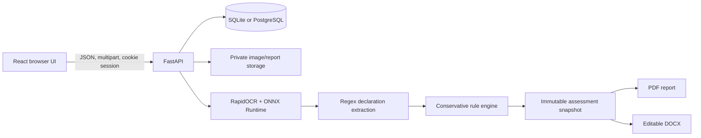

# Recreate CompliSense from scratch

This guide explains how a six-member team can rebuild the working CompliSense prototype, understand the major decisions, test the complete workflow, and deploy it. It assumes beginner-to-intermediate knowledge of Python, TypeScript, HTML, CSS, and Git.

## 1. Product boundary

The prototype helps an inspector review ordinary household packaged-product labels. It accepts photographs, runs local OCR, extracts declaration candidates, evaluates a small source-backed rule catalogue, supports human corrections and reviewer decisions, and exports frozen reports.

Keep these product rules throughout the build:

- Evidence is primary. Preserve original images and show where OCR text came from.
- Uncertainty is visible. Missing OCR text is not proof that a label declaration is absent.
- Humans own legal decisions. The tool records potential issues and review outcomes.
- Reports are reproducible. Export from immutable assessment snapshots.
- Scope is explicit. The demo does not claim universal packaged-commodity coverage.

## 2. Six-member team structure

Use file ownership during the 36-hour build so two people do not unknowingly rewrite the same module.

| Member | Primary role | Main ownership | Demo responsibility |
| --- | --- | --- | --- |
| 1 | Product and legal-rules lead | `docs/`, rule catalogue in `backend/app/services/rules.py` | Explain the problem, scope, sources, limitations, and judge alignment |
| 2 | Frontend and UX lead | `frontend/src/pages/`, `frontend/src/components/`, CSS | Demonstrate the inspector flow on desktop and mobile |
| 3 | Backend and security lead | API routers, models, database, auth, permissions | Explain sessions, CSRF, roles, persistence, and audit history |
| 4 | OCR and extraction lead | `services/ocr.py`, `images.py`, `extraction.py`, `processing.py` | Explain real OCR, bounding boxes, confidence, and failure handling |
| 5 | Reports and quality lead | `services/reports.py`, tests, benchmark records | Show frozen PDF/DOCX output and report test evidence |
| 6 | Integration and deployment lead | config, Docker, end-to-end checks, demo data | Run the integrated system, deployment, backups, and final demo rehearsal |

Every member should commit their own work and be able to explain one design decision, one failure they found, and how they verified the fix. The 2024 historical SIH evaluator guidance explicitly included individual contribution under teamwork.

### Suggested 36-hour handoffs

| Time | Shared checkpoint |
| --- | --- |
| Hour 0–2 | Agree on the supported category, API contract, rule fields, sample labels, and file ownership |
| Hour 2–6 | Authentication, database, upload UI, first real OCR output, and initial source matrix work independently |
| Hour 6–10 | Integrate upload -> OCR -> extracted fields -> first findings |
| Hour 10–16 | Improve corrections, uncertain states, image coverage, and reviewer workflow |
| Hour 16–22 | Integrate reports, inspection history, dashboard, and audit trail |
| Hour 22–24 | Freeze core behavior; only fix integration and serious usability defects |
| Hour 24–30 | Held-out labels, responsive checks, security checks, mentor feedback, and measured improvements |
| Hour 30–36 | Deployment rehearsal, report inspection, final pitch, backup demo recording, and team Q&A |

## 3. Architecture



One FastAPI process is enough for the hackathon. It also serves the compiled React files in a single-origin deployment. This reduces configuration, avoids cross-site cookie complexity, and makes the demo easy to run on one laptop.

## 4. Install the toolchain

Install:

- Git
- Python 3.12
- Node.js 20 or newer
- Docker Desktop only if you want the container/PostgreSQL deployment

Check the tools:

```powershell
git --version
py -3.12 --version
node --version
npm --version
docker --version
```

Create the project:

```powershell
mkdir CompliSense
cd CompliSense
git init
git switch -c feat/complisense
mkdir backend, frontend, docs
py -3.12 -m venv .venv
```

## 5. Build the backend foundation

Member 3 leads this section.

Create `backend/requirements.txt` with FastAPI, Uvicorn, SQLAlchemy, multipart parsing, Pillow, RapidOCR, ONNX Runtime, OpenCV, NumPy, ReportLab, python-docx, psycopg, and python-dotenv. Install it:

```powershell
.\.venv\Scripts\python.exe -m pip install --upgrade pip
.\.venv\Scripts\python.exe -m pip install -r backend\requirements.txt
```

Create a small `Settings` dataclass in `backend/app/config.py` that reads:

- `DATA_DIR`, defaulting to `backend/data`;
- `DATABASE_URL`, defaulting to SQLite inside the data directory;
- `COOKIE_SECURE`;
- `ALLOWED_ORIGINS`;
- upload size, image count, and session lifetime limits.

Create SQLAlchemy tables for:

- users;
- login sessions;
- inspections;
- evidence images;
- immutable assessments; and
- audit events.

Use JSON columns for small OCR documents, field dictionaries, findings, and frozen snapshots. Store image bytes on private disk with a generated filename rather than inside the database.

For the demo, `Base.metadata.create_all()` keeps setup simple. Add Alembic migrations before a real pilot so schema changes can be reviewed and rolled back.

## 6. Add authentication and permissions

Hash passwords with the standard-library `hashlib.scrypt`, a fresh random salt, and constant-time comparison. Store only the encoded parameters, salt, and derived hash.

On successful login:

1. Generate a high-entropy random session token.
2. Store only its SHA-256 hash in the database.
3. Generate a separate CSRF token.
4. Send the session token in an HttpOnly, SameSite=Lax cookie.
5. Return the CSRF token to the frontend and require it on every mutation after login.

Authorization rules:

- inspectors can see and change only inspections they own;
- reviewers can see all inspections;
- only reviewers can submit a review decision; and
- every download must re-check access to its parent inspection.

Add rate limiting for repeated login failures, generic invalid-credential errors, upload content validation, generated private filenames, and `Cache-Control: private, no-store` for reports.

## 7. Implement image intake and real OCR

Member 4 leads this section.

For each upload:

1. Reject files larger than 10 MB.
2. Decode with Pillow instead of trusting the filename or MIME header.
3. Allow only JPEG, PNG, and WebP.
4. Normalize EXIF orientation.
5. Check pixel dimensions and decompression-bomb limits.
6. Store the validated bytes under a generated name.
7. Record a SHA-256 digest, panel tag, width, and height.

Use RapidOCR with ONNX Runtime for a local CPU baseline. Return every line as:

```json
{
  "text": "Net Quantity 100 g",
  "confidence": 0.94,
  "box": [[35, 80], [310, 80], [310, 112], [35, 112]]
}
```

The box is important: the frontend can draw it over the original image when an inspector focuses a declaration.

Calculate simple image-quality warnings, such as very small dimensions or weak sharpness. Treat them as capture guidance, not legal findings.

Process at most a small number of OCR jobs concurrently. If the server restarts while an inspection is `processing`, mark it `failed` on startup and preserve the uploaded evidence so the user can retry.

## 8. Extract declaration candidates

Use transparent regex and line-neighbour rules before considering a trained model. They are quick to debug during a hackathon and easy to explain to judges.

Normalize OCR text, then find candidates for:

- product name;
- manufacturer, packer, or importer;
- address;
- net quantity;
- MRP or retail price;
- manufacture, packing, or import date;
- consumer-care details; and
- country of origin.

Keep the original OCR line, image ID, box, and confidence with each candidate. When an inspector edits a field, mark the source as `manual` and keep an audit event. Emptying a field is also a meaningful correction.

Do not present regex extraction as artificial intelligence. The useful system behavior is the integrated evidence, applicability, uncertainty, correction, and review workflow.

## 9. Build the conservative rule engine

Member 1 owns the rule catalogue while Member 4 supplies the extracted fields.

Each rule needs:

- a stable ID;
- title and field;
- displayed provision;
- official source URL;
- applicability condition; and
- a plain-language explanation.

Use four states:

| State | Meaning |
| --- | --- |
| `pass` | The supplied evidence supports this implemented check |
| `potential_violation` | Sufficient evidence suggests a specific failure, still requiring human review |
| `needs_review` | Evidence, OCR, measurement, or applicability is uncertain |
| `not_applicable` | Recorded context excludes this rule |

A missing extracted value can become `potential_violation` only when scope is confirmed, relevant panel coverage is confirmed, and the images have no quality warnings. Otherwise it stays `needs_review`.

Country of origin is `not_applicable` for a product explicitly recorded as domestic, `needs_review` for unknown origin, and evaluated for an imported product.

Keep readability, placement, and type size as assisted manual checks until the system has calibrated measurements and validated error bounds. Read [the legal source map](research/LEGAL_RULES_RESEARCH.md) before extending the catalogue.

## 10. Version assessments and reports

Every analysis or post-analysis correction creates a new assessment record. Put all report inputs into one JSON snapshot:

- inspection context;
- evidence metadata and private stored image references;
- declarations and provenance;
- findings and source links;
- manual checks;
- rule version;
- summary counts; and
- review state.

Generate PDF and DOCX from this snapshot, never from the live inspection row. This prevents a later correction or rule update from changing an old report.

Member 5 should keep the report layout restrained and readable. Include the scope and limitations, every finding's explanation, the source/provision, declaration values, evidence thumbnails where practical, and reviewer notes.

Test that PDF text is extractable and contains the expected product, assessment ID, limitations, and findings. Open both formats visually before the final demo.

## 11. Expose the API

Keep routers grouped by responsibility:

- `auth.py`: login, current user, logout;
- `inspections.py`: list, dashboard, create, read, edit, upload, image access, review;
- `analysis.py`: start OCR/rules processing;
- `reports.py`: versioned PDF/DOCX download; and
- `reference.py`: health, rule catalogue, and synthetic samples.

Return a full inspection document after mutations. This keeps beginner-friendly frontend state management simple.

Use an integer inspection `version` for optimistic locking. Every edit includes the version the browser last saw. Return HTTP 409 when another edit has already changed the record, prompting the user to reload instead of silently overwriting work.

The complete request and response contract is in [BUILD_CONTRACT.md](BUILD_CONTRACT.md).

## 12. Build the React interface

Member 2 leads this section.

Scaffold Vite:

```powershell
npm create vite@latest frontend -- --template react-ts
cd frontend
npm install
npm install react-router-dom lucide-react
cd ..
```

Create one small API module around `fetch`. Always use `credentials: 'include'`; attach `X-CSRF-Token` to mutations; parse FastAPI errors into readable UI messages.

Create these routes:

- `/login`;
- `/` dashboard;
- `/inspections` register and search;
- `/inspections/new` context and evidence capture;
- `/inspections/:id` evidence, declarations, assessment, reports, and audit; and
- `/rules` supported scope and limitations.

Recommended component split:

- `Layout`: navigation, role, and sign out;
- `UploadPicker`: local previews and panel selection;
- `EvidenceViewer`: image, OCR boxes, thumbnails, and raw text;
- `DeclarationsEditor`: extracted values, confidence, notes, and correction save;
- `AssessmentPanel`: status totals, findings, assisted checks, and reviewer decision;
- `ReportHistory`: immutable versions and downloads; and
- small shared loading, empty, error, and status components.

Use a work-focused responsive layout. Keep controls compact, make horizontal tab overflow intentional, stack the evidence and declaration columns below tablet widths, and verify that long filenames, IDs, product names, and error text wrap. Use actual icons for familiar actions and label less familiar icon-only controls with tooltips or accessible names.

Do not put instructions about the implementation into the live UI. Show only information an inspector needs to decide or act.

## 13. Connect frontend and backend

In Vite development mode, proxy `/api` to `http://127.0.0.1:8000`. For the packaged application, run `npm run build`; FastAPI detects `frontend/dist`, mounts its assets, and returns `index.html` for client-side routes.

Local development uses two terminals:

```powershell
# Terminal 1
cd backend
..\.venv\Scripts\python.exe -m uvicorn app.main:app --reload --host 127.0.0.1 --port 8000
```

```powershell
# Terminal 2, repository root
npm.cmd --prefix frontend run dev
```

The single-server demo uses:

```powershell
npm.cmd --prefix frontend run build
cd backend
..\.venv\Scripts\python.exe -m uvicorn app.main:app --host 127.0.0.1 --port 8000
```

## 14. Add users and synthetic demo labels

Do not add public signup to a 36-hour inspection prototype. Build a CLI:

```powershell
cd backend
..\.venv\Scripts\python.exe -m app.cli create-user --email officer@example.in --name "Inspection Officer" --role inspector
```

Provide an explicit `seed-demo` command for local use. Keep predictable demo passwords out of automatic startup and clearly mark generated labels as fictional. A synthetic complete label, an incomplete label, and a noisy label let the team rehearse pass, potential-violation, and needs-review states without distributing a real brand's packaging.

## 15. Test the system

Member 5 owns the test ledger, but every member fixes failures in their area.

Backend checks:

```powershell
.\.venv\Scripts\python.exe -m pytest backend -q
.\.venv\Scripts\python.exe -m ruff check backend
```

Frontend check:

```powershell
npm.cmd --prefix frontend run build
```

Minimum meaningful automated cases:

- invalid login and login throttling;
- CSRF rejection;
- inspector cannot access another inspector's record;
- reviewer can view and decide;
- invalid or oversized image rejection;
- path traversal rejection;
- uncertain evidence does not become an automatic violation;
- imported/domestic/unknown applicability behavior;
- stale optimistic-lock update returns 409;
- assessment snapshots remain unchanged after later edits; and
- PDF and DOCX are generated from the selected assessment.

Browser rehearsal:

1. Sign in as inspector.
2. Create an inspection and upload the complete synthetic label.
3. Run OCR and wait for `ready`.
4. Inspect bounding boxes and correct one field.
5. Record assisted checks and download PDF/DOCX.
6. Sign in as reviewer and submit a follow-up decision.
7. Repeat the important views at approximately 390 x 844 and 1440 x 900.
8. Check browser console errors, broken downloads, overflow, inaccessible controls, and blank loading states.

For judge evidence, test a few held-out real labels and record hardware, image conditions, processing time, correctly extracted fields, missed fields, false candidates, and abstentions. Do not present a tiny hand-picked set as general accuracy.

## 16. Production deployment

Member 6 leads deployment with Member 3 reviewing security.

### Docker and PostgreSQL

The repository includes a multi-stage `Dockerfile` and `compose.yaml`. The Node stage builds React. The Python stage installs the API and OCR dependencies, runs as a non-root user, and serves the compiled frontend. Compose adds PostgreSQL plus persistent volumes for database data and private application files.

```powershell
Copy-Item .env.production.example .env
# Edit .env and replace POSTGRES_PASSWORD.
docker compose up --build -d
docker compose ps
docker compose logs -f app
```

Create real accounts:

```powershell
docker compose exec app python -m app.cli create-user --email officer@example.in --name "Inspection Officer" --role inspector
docker compose exec app python -m app.cli create-user --email reviewer@example.in --name "Review Officer" --role reviewer
```

Open `http://localhost:8000`. Do not seed predictable demo users on a public server.

### HTTPS and reverse proxy

Use a domain and an HTTPS reverse proxy such as Caddy, Nginx, or a managed platform load balancer. `deploy/Caddyfile.example` shows the smallest Caddy setup. Point the domain to the server, keep the application port private when possible, and proxy to `127.0.0.1:8000`.

After HTTPS works, set:

```dotenv
COOKIE_SECURE=true
ALLOWED_ORIGINS=https://complisense.example.in
```

Restart the application:

```powershell
docker compose up -d
```

### Vercel frontend

Vercel is used for the React interface, while the FastAPI/OCR service stays on the persistent Python deployment above. From the repository root, the included `vercel.json` installs `frontend/`, builds the Vite app, and serves the SPA routes.

```powershell
npm.cmd install --global vercel
vercel login
vercel --prod
```

Set the Vercel project environment variable `VITE_API_BASE_URL` to the HTTPS origin of the FastAPI service, then redeploy. The frontend deployment is intentionally separated from OCR and private file storage because Vercel function filesystems are ephemeral and are not suitable for inspection evidence or generated reports. Keep `COOKIE_SECURE=true` and add the Vercel origin to `ALLOWED_ORIGINS` on the API.

The FastAPI command trusts forwarded headers because the container is expected to sit behind that proxy. Restrict direct access to port 8000 with the host firewall in a public deployment.

### Backups and operations

Back up both stores together:

- PostgreSQL contains users, inspection metadata, OCR output, findings, audit history, and assessment snapshots.
- The application-data volume contains private original images and cached reports.

For a pilot, add:

- scheduled `pg_dump` backups and volume/file backups;
- restore drills;
- database migrations;
- centralized logs and error monitoring;
- malware scanning and retention rules for uploaded files;
- per-organization data separation;
- password reset and account lifecycle procedures;
- a worker queue if OCR demand exceeds one process; and
- an approved, versioned legal-rule release process.

Do not scale the web container to multiple replicas while using only a local application-data volume. Use shared private object storage and a real job queue first.

## 17. Judge-facing demonstration

Structure the live demo around evidence rather than feature count:

1. State the user and problem: an inspector needs a traceable first review of package declarations.
2. Upload a real or clearly synthetic label and run real local OCR.
3. Select a declaration so the evidence box is visible.
4. Show an uncertain or incomplete case becoming `needs_review` rather than a false accusation.
5. Correct a field and show the new assessment/audit entry.
6. Export the report and let the reviewer record a follow-up.
7. Close with measured results, limitations, deployment cost, and the next pilot.

This directly supports the official 2026 criteria of novelty, clarity, feasibility, practicability, sustainability, impact, user experience, and future progression. The detailed research and historical rubric caveat are in [SIH_JUDGING_RESEARCH.md](research/SIH_JUDGING_RESEARCH.md).

## 18. Common mistakes

- Treating every OCR miss as a violation creates unsafe false positives.
- Hardcoding findings for demo images proves only the UI, not the system.
- Editing live inspection data inside an old report breaks auditability.
- Publicly deploying demo credentials exposes all inspection data.
- Calling an OCR engine a custom AI model weakens technical credibility.
- Building many charts before the upload-to-report flow works wastes the integration window.
- Adding automatic font-size claims without a reference scale and validation creates an indefensible result.
- Waiting until the final hours to test on the presentation laptop risks model, browser, and native-library failures.

## 19. Where to learn the final implementation

Read in this order:

1. `backend/app/main.py` for application assembly.
2. `backend/app/models.py` and `database.py` for persistence.
3. `backend/app/security.py`, `dependencies.py`, and `routers/auth.py` for authentication.
4. `services/ocr.py`, `extraction.py`, `rules.py`, and `processing.py` for the analysis pipeline.
5. `routers/inspections.py` and `analysis.py` for the workflow API.
6. `services/reports.py` for frozen exports.
7. `frontend/src/api.ts`, `auth.tsx`, and `main.tsx` for browser integration.
8. `frontend/src/pages/InspectionPage.tsx` and its components for the main user workflow.
9. `backend/tests/` for executable examples of expected behavior.

The code favors explicit functions and ordinary React state so a beginner can trace a request from the button, through the API, into the database and service layer, and back to the screen.
